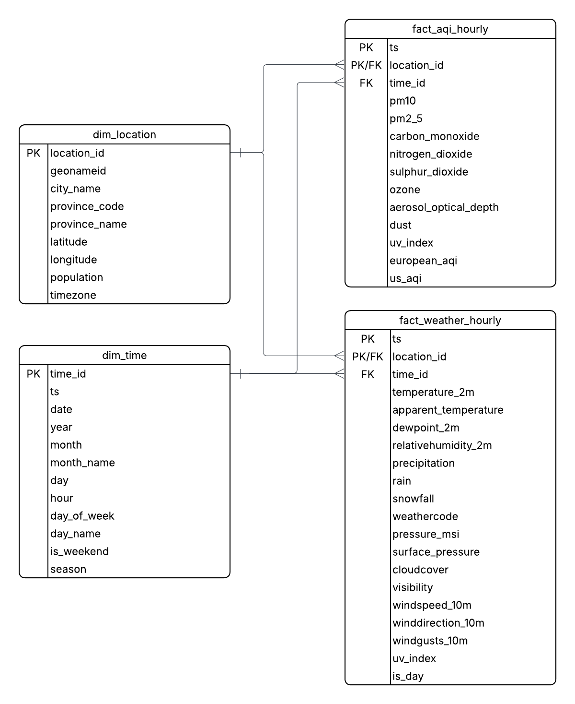
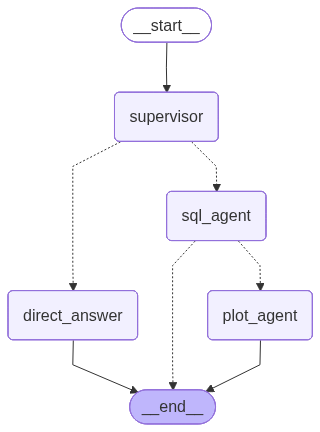

# Pakistan Weather & AQI ETL Pipeline

A production-grade, fully orchestrated ETL pipeline that ingests **hourly weather & air quality data** for all Pakistani cities from the [Open-Meteo API](https://open-meteo.com/), transforms it into a star-schema data warehouse, loads it into a **TimescaleDB** (PostgreSQL) hypertable, and exposes a **LangGraph-powered AI agent** for natural-language querying over the data.

---

## Architecture Overview

```
Open-Meteo Archive API          Open-Meteo Air Quality API
        |                                   |
        v                                   v
  ingest/raw_weather.py          ingest/raw_aqi.py
        |                                   |
        v                                   v
 transform/transform_weather   transform/transform_aqi
        |                                   |
        v                                   v
   load/load_weather            load/load_aqi
        |                                   |
        +---------------+-------------------+
                        |
                        v
              TimescaleDB (PostgreSQL)
          +---------------------------+
          |  dim_location             |
          |  dim_time                 |
          |  fact_weather_hourly  *   |
          |  fact_aqi_hourly      *   |
          |  weather_daily (agg)      |
          |  aqi_daily (agg)          |
          +---------------------------+
                        |
                        v
          LangGraph AI Agent (FastAPI)
          +----------------------------+
          |  supervisor -> sql_agent   |
          |             -> plot_agent  |
          |           -> direct_answer |
          +----------------------------+
```

\* Backed by TimescaleDB hypertables with 7-day chunk intervals

All tasks are orchestrated by **Apache Airflow 2.9** running inside Docker.

---

## Key Features

| Feature | Detail |
|---|---|
| **Data Sources** | Open-Meteo Archive & Air Quality APIs (free, no key needed) |
| **Coverage** | All Pakistani cities via `geonamescache` |
| **Scheduler** | Apache Airflow 2.9 — daily DAG at midnight UTC |
| **Storage** | TimescaleDB on PostgreSQL 16 — hypertables + continuous aggregates |
| **Data Model** | Star schema — 2 dimension tables, 2 fact hypertables, 2 daily aggregates |
| **ETL Format** | Polars DataFrames serialized via Apache Arrow IPC (XCom-safe) |
| **Retry Logic** | `tenacity` exponential backoff (up to 4 retries per city) |
| **AI Agent** | LangGraph multi-node graph (Supervisor -> SQL / Plot / Direct Answer) |
| **LLM Backend** | Groq (default) or OpenRouter |
| **API** | FastAPI with session-aware conversation history |
| **Containerized** | Docker Compose — TimescaleDB + Airflow webserver + scheduler |

---

## Database Schema

The warehouse follows a **star schema** stored in TimescaleDB:



### Tables

| Table | Type | Description |
|---|---|---|
| `dim_location` | Dimension | City metadata — geonameid, coordinates, province, timezone |
| `dim_time` | Dimension | Time breakdowns — year, month, day, hour, season, weekend flag |
| `fact_weather_hourly` | Fact (Hypertable) | 17 hourly weather metrics per city |
| `fact_aqi_hourly` | Fact (Hypertable) | 13 hourly AQI metrics per city (PM2.5, PM10, CO, NO2, SO2, ozone...) |
| `weather_daily` | Continuous Aggregate | Daily rollups (avg/max/min temp, precipitation, wind, UV...) |
| `aqi_daily` | Continuous Aggregate | Daily rollups (avg/max PM2.5, PM10, AQI scores...) |

Hypertables use **7-day chunk intervals** and the continuous aggregates refresh every hour with a 1-hour end offset.

---

## AI Agent

The pipeline ships with a **LangGraph multi-agent graph** that accepts natural-language questions about the data and routes them to the appropriate specialist node.



### Agent Nodes

| Node | Role |
|---|---|
| **supervisor** | Classifies intent: `sql_only` · `sql_and_plot` · `direct_answer` |
| **sql_agent** | Generates & executes parameterized SQL against TimescaleDB |
| **plot_agent** | Produces a matplotlib/seaborn chart from SQL results (returned as base64 PNG) |
| **direct_answer** | Answers general questions directly from the LLM without hitting the DB |

**Example queries you can ask:**
- *"What was the average PM2.5 in Lahore last month?"*
- *"Plot the temperature trend for Karachi over the past week."*
- *"Which city had the worst air quality yesterday?"*
- *"Compare precipitation levels across Punjab cities in January."*

---

## Project Structure

```
weather-etl-pipeline/
|
+-- dags/
|   +-- weather_aqi_dag.py       # Airflow DAG -- orchestrates all tasks
|
+-- ingest/
|   +-- cities.py                # Fetches all PK cities via geonamescache
|   +-- raw_weather.py           # Extracts hourly weather from Open-Meteo
|   +-- raw_aqi.py               # Extracts hourly AQI from Open-Meteo
|
+-- transform/
|   +-- transform_weather.py     # Cleans & builds dim_location, dim_time, fact_weather
|   +-- transform_aqi.py         # Cleans & builds fact_aqi
|
+-- load/
|   +-- load_weather.py          # Upserts dim + fact_weather_hourly into TimescaleDB
|   +-- load_aqi.py              # Upserts fact_aqi_hourly into TimescaleDB
|
+-- agent/
|   +-- graph.py                 # LangGraph pipeline definition
|   +-- main.py                  # FastAPI server -- /query endpoint
|   +-- state.py                 # AgentState TypedDict
|   +-- schema_context.py        # DB schema injected into LLM prompts
|   +-- nodes/
|   |   +-- supervisor.py        # Intent classification node
|   |   +-- sql_agent.py         # SQL generation + execution node
|   |   +-- plot_agent.py        # Chart generation node
|   |   +-- direct_answer.py     # Direct LLM answer node
|   +-- tools/                   # Reusable tool wrappers
|   +-- ui/                      # Minimal web UI (index.html)
|
+-- scripts/
|   +-- init_db.sh               # Creates Airflow metadata DB on first run
|
+-- init.sql                     # Full TimescaleDB schema DDL
+-- Dockerfile.airflow            # Airflow image with pipeline dependencies
+-- docker-compose.yml            # TimescaleDB + Airflow webserver + scheduler
+-- requirements.txt              # Python dependencies
+-- .env.example                  # Environment variable template
+-- analysis.ipynb                # Exploratory data analysis notebook
+-- diagnose_data.py              # Data quality diagnostic script
+-- Schema.png                    # DB schema diagram
+-- agent_graph.png               # LangGraph agent diagram
```

---

## Quick Start

### Prerequisites

- [Docker](https://www.docker.com/get-started) & Docker Compose
- Python 3.11+ (for local development / running the agent outside Docker)
- A free [Groq API key](https://console.groq.com/) for the AI agent

---

### 1. Clone the Repository

```bash
git clone https://github.com/your-username/weather-etl-pipeline.git
cd weather-etl-pipeline
```

### 2. Configure Environment

```bash
cp .env.example .env
```

Edit `.env` and fill in:

| Variable | Description |
|---|---|
| `POSTGRES_PASSWORD` | Password for the TimescaleDB user |
| `AIRFLOW_FERNET_KEY` | Generate with the command in `.env.example` |
| `AIRFLOW_ADMIN_PASSWORD` | Airflow UI admin password |
| `GROQ_API_KEY` | Your Groq API key (free tier works great) |

> **Note:** `WEATHER_API_URL` and `AQI_API_URL` are pre-filled. Open-Meteo is completely free with no authentication required.

### 3. Start the Stack

```bash
docker compose up --build -d
```

This will spin up:
- **TimescaleDB** on `localhost:5433`
- **Airflow Webserver** on `http://localhost:8080`
- **Airflow Scheduler** (background)
- The `airflow_init` one-shot container that runs DB migrations and creates the admin user.

### 4. Access the Airflow UI

Open [http://localhost:8080](http://localhost:8080) and log in with the credentials from your `.env`:

```
Username: admin   (or your AIRFLOW_ADMIN_USER)
Password: your AIRFLOW_ADMIN_PASSWORD
```

Enable and trigger the `weather_aqi_pipeline` DAG. It runs daily at midnight UTC and supports manual backfill.

### 5. Run the AI Agent

```bash
# Install dependencies
pip install -r requirements.txt

# Start the FastAPI server
uvicorn agent.main:app --reload --port 8000
```

Open [http://localhost:8000](http://localhost:8000) for the built-in web UI, or query via the API:

```bash
curl -X POST http://localhost:8000/query \
  -H "Content-Type: application/json" \
  -d '{"query": "What was the hottest city in Pakistan last week?"}'
```

---

## Airflow DAG — Task Flow

```
fetch_weather --> transform_weather --> load_weather ---------+
                                              |                +--> verify_load
fetch_aqi     --> transform_aqi     --> load_aqi (dep: weather)+
```

| Task | Description |
|---|---|
| `fetch_weather` | Pulls 17 hourly weather fields for all PK cities |
| `fetch_aqi` | Pulls 13 hourly AQI metrics for all PK cities |
| `transform_weather` | Cleans data, builds dimension & fact DataFrames |
| `transform_aqi` | Cleans AQI data, builds fact DataFrame |
| `load_weather` | Upserts `dim_location`, `dim_time`, `fact_weather_hourly` |
| `load_aqi` | Upserts `fact_aqi_hourly` (runs after `load_weather` to ensure dims exist) |
| `verify_load` | Asserts non-zero inserts for both fact tables — fails loudly otherwise |

**Retry policy:** 2 retries with 5-minute delay and exponential backoff. Each city-level HTTP request also retries independently up to 4x via `tenacity`.

---

## Data Sources

| Source | API | Auth |
|---|---|---|
| Hourly Weather | [Open-Meteo Archive API](https://open-meteo.com/en/docs/historical-weather-api) | None (free) |
| Hourly Air Quality | [Open-Meteo Air Quality API](https://open-meteo.com/en/docs/air-quality-api) | None (free) |
| City Metadata | [`geonamescache`](https://pypi.org/project/geonamescache/) Python library | None |

---

## Tech Stack

| Layer | Technology |
|---|---|
| **Orchestration** | Apache Airflow 2.9 (LocalExecutor) |
| **Data Processing** | Polars 0.20 + Apache Arrow IPC |
| **Database** | TimescaleDB (PostgreSQL 16) |
| **HTTP Client** | httpx + tenacity |
| **AI Agent** | LangGraph + LangChain |
| **LLM** | Groq (Llama 3 / Mixtral) |
| **API Server** | FastAPI + Uvicorn |
| **Visualization** | Matplotlib + Seaborn |
| **Containerization** | Docker + Docker Compose |

---

## Analysis

An exploratory analysis notebook is included at [`analysis.ipynb`](analysis.ipynb). It covers:

- Temperature and precipitation trends by city and province
- AQI seasonal patterns
- Correlation between weather metrics and air quality
- City-level comparisons

---

## License

This project is released under the [MIT License](LICENSE).

---

*Data sourced from Open-Meteo — free, open, and no sign-up required.*
